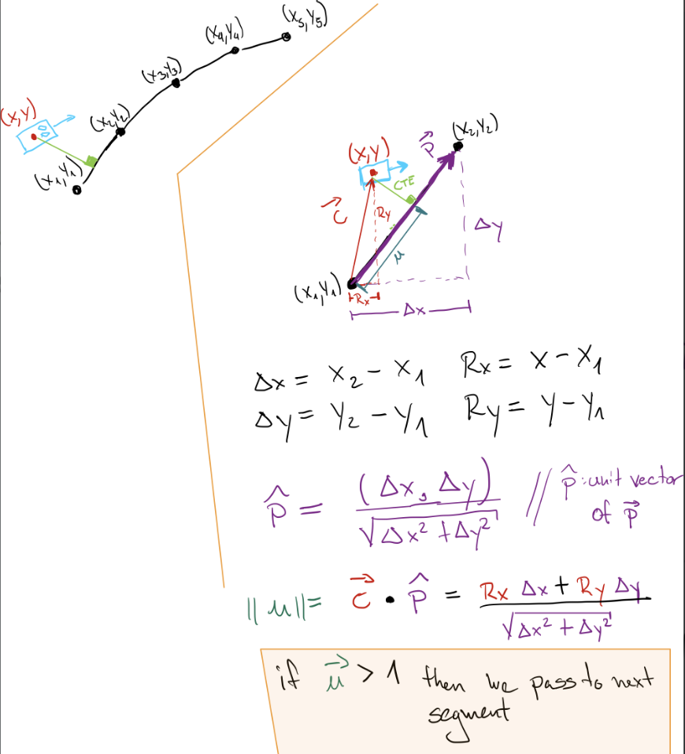
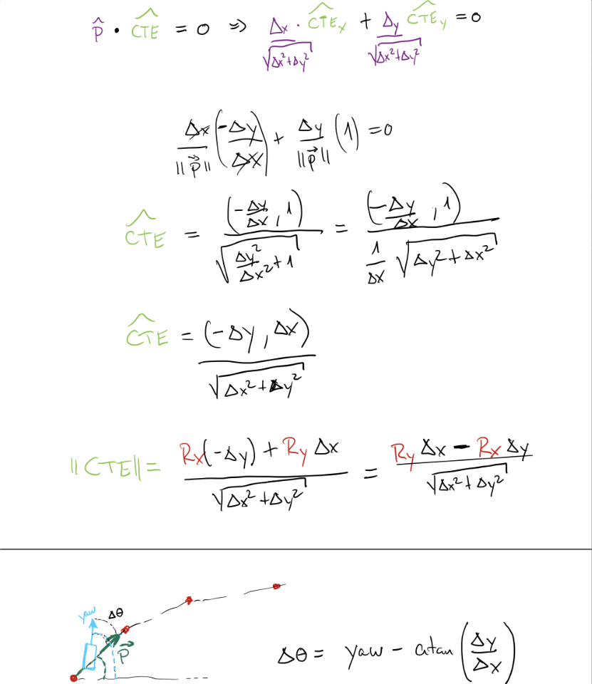

# Control and Trajectory Tracking for Autonomous Vehicle

# Proportional-Integral-Derivative (PID)

In this project, I designed 2 PID controllers to perform vehicle trajectory tracking. Given a trajectory as an array of locations, and a simulation environment, a PID controller algorithm was developed, and then used for controlling the steering and the throttle of the vehicle. Finally it was tested on the CARLA simulator used in the industry for assessing its performance.


<center>
<div class="row">
  <div class="column">
    
    
    
  </div>
   <center><span class="caption"> short illustrations to depict the performance of the PID controller  </span></center>
</div>
</center>

### Installation

The project was developed in the Udacity workspcae. Hence, run the following commands to install the starter code in the Udacity Workspace:

place this project inside the Udacity workspace and the run the following steps to compile the project and to run the Carla simulator:

## Run Carla Simulator

Open new window

* `su - student`
// Will say permission denied, ignore and continue
* `cd /opt/carla-simulator/`
* `SDL_VIDEODRIVER=offscreen ./CarlaUE4.sh -opengl`

## Compile and Run the Controller

Open new window

* `cd nd013-c6-control-starter/project`
* `./install-ubuntu.sh`
* `cd pid_controller/`
* `rm -rf rpclib`
* `git clone https://github.com/rpclib/rpclib.git`
* `cmake .`
* `make` (This last command compiles the c++ code)

## Testing

To run the simulator on the desktop environment please do the following:

* `cd nd013-c6-control-starter/project`
* `./run_main_pid.sh`
This will silently fail `ctrl + C` to stop
* `./run_main_pid.sh` (again)
Go to desktop mode to see CARLA

If error bind is already in use, or address already being used

* `ps -aux | grep carla`
* `kill id`


## Environment Description

In the previous project we built a path planner for the autonomous vehicle. So in this project we focus on building the steer and throttle controller so that the car follows the trajectory.

You will design and run the a PID controller as described in the previous course.

The most relevant files in this project are:

* [pid_controller.h](./project/pid_controller/pid_controller.h) - In this file we can find the definition of all functions and variables involving the pid_controller
* [pid_controller.cpp](./project/pid_controller/pid_controller.cpp) - In this file we can find the implementation of the PID controller.
* [main.cpp](./project/pid_controller/main.cpp) - In this file we defined all the pipeline to control the steering and throttle and follow the path planner's waypoints. 
* [plot_pid.py](./project/plot_pid.py) - In this file we implemented some code to better visualize the performance of our controllers. It has the following 3 plots:
    * **Position request(waypoints) vs real Vehicles position (in CARLA)**. This plot was extremely useful to debug the code while developing since here we could easily visualize if the controller is overshooting or if it is oscillating. 
    * **Steering plot** - Containing 2 signals Steering error and PID Steering output(AKA control output or control signal)
    * **Throttle plot** - Containing 3 signals Throttle error, PID Throttle output(when the control output is positive) and Brake output (when the control output is negative).

&nbsp;&nbsp;&nbsp;&nbsp;&nbsp;&nbsp;&nbsp;&nbsp;&nbsp;&nbsp;&nbsp;**Note:** The values of the error and the pid command are saved in [throttle_pid_data.txt](./project/throttle_pid_data.txt) and [steer_pid_data.txt](./project/steer_pid_data.txt)

**Note 2:** Run the plots by using the command (in nd013-c6-control-refresh/project):

```
python3 plot_pid.py
```

You must install a few additional python modules to run these plots: 

```
pip3 install pandas
pip3 install matplotlib
```

* **Useful variables for Throttle controller:**
    - The last point of **v_points** vector contains the velocity computed by the path planner.
    - **velocity** contains the actual velocity.
    - The output of the controller should be inside [-1, 1].

* **Useful variables for Steering controller:**
    - The variable **y_points** and **x_point** gives the desired trajectory planned by the path_planner.
    - **yaw** gives the actual rotational angle of the car.
    - The output of the controller should be inside [-1.2, 1.2].
    - If needed, the position of the car is stored in the variables **x_position**, **y_position** and **z_position**

### Environment Tips:

- When testing the c++ code, restart the Carla simulator to remove the former car from the simulation.
- If the simulation freezes on the desktop mode but is still running on the terminal, close the desktop and restart it.


# Project implementation description

I started by developing the PID controller. Hence, I defined a proportional error (ep), derivate error (ed) and integral error (ie). After that the I set the gains for each of the errors. In the end the PID control output was given by the following equation:

```
u = kp * ep + ki*ei + kd * ed
```

where: 

* kp, ki, kd are the gains for the proportional, integral and differential terms.
* ep is the proportional error that is the same as the current error
* ei is the integral of the error that was defined by the change in time (dt) * current error as this is a discrete system.  
* ed is the differential error that is defined as delta_error/dt


After implementing these two errors I had to define how the error for both steering and throttle will be computed. I started with the steering as it was more challenging. 

## Steering error definition. 

I designed the steering error based on the concept of cross track error (CTE) and the angle difference between the yaw and the angle generated by the waypoints segments. 

To implement the CTE I did some drawings which I will use to also illustrate this explanation. 

<center></center>

As we can see above the vehicle is presented with a set of waypoints that it has to follow. For this project the vector size of waypoints is 20. Hence, a vector `[(x1,y1),(x2,y2),...(x20,y20)]` of waypoint pairs are presented. 

We use this information to first calculate the projection of our current vehicle position (depicted in the diagram above as (x,y)) to the segments between each waypoints. i.e. I assume a vector between waypoints and then another vector from the beginning of the starting point of the waypoint segment to the current position of our ego car. We finally normalize this projection by using the unit vector of the waypoint segment (the unit vector of the purple vector) 

This projection helped me determined when to change of segment. If the projection exceeds the magnitude of 1 that means that I must use the next segment and so on. 

However, the real CTE value was calculated by projecting our vector `C` to the perpendicular unit vector of the waypoint segment (depicted in green in the diagram above). To achieve this I used the dot product property since two vectors that are perpendicular to each other have a dot product of zero. The whole derivation is shown below: 

<center></center>

In the end the final equation for the CTE is as follows:

```
CTE = (Ry*delta_x - Rx * delta_y)/sqrt(delta_x^2+delta_y^2)
```

On the other hand, the last diagram in the image above depicts the angle difference between the yaw and the waypoint segment vector. For this I used atan2 instead of atan since it avoids division by zero and has a range between [-pi, pi]. Thus the angle difference is defined as follows:

```
delta_theta = yaw - atan2(delta_y,delta_x)
```
Finally we add this two errors to define the final steering error as follows:

```
steering error = CTE + angle_factor * delta_theta
```
where `angle_factor` is just a factor that I added to control how much influence delta_theta will have in the steering error. 

The steering error was designed this way as the delta_theta accounts for quick changes in the winding path whereas the CTE is more stable and measure how far the ego car is from the waypoint segment. In the end, this combination proved to be successful for our use case.

## Throttle error

For the throttle error the implementation was pretty straightforward as I defined as the difference between the current velocity and the velocity of the last waypoint of the current segment computed by the CTE explained in the steering error section.

```
Throttle error = Velocity[segment] - Current_velocity
```

## PID calibration

To calibrate the PID I followed a basic approach used in control theory which is basically trial and error. However, the trial and error approach I followed has an algorithm to get some set of gains that stabilize the system quicker. This algorithm is as follows:

* Set to zero integral and derivative gains and increase the proportional gain until the system starts to reach the request with some oscillations. 
* Decrease the proportional until oscillations are almost decreased. At this point I mostly get some stationary error.
* To get rid of the stationary error I gradually increase the integral gain.
* Finally if needed I increase the derivative gain especially if the system has sudden changes of requests. For instance, in the steering, this happened when we turned to the right in the first traffic light. However, I almost always leave the derivative gain smaller than the other gains as it is very sensitive to noisy signals which we always have in electrin/electronic systems.

Answer the following questions:
- Add the plots to your report and explain them (describe what you see)
- What is the effect of the PID according to the plots, how each part of the PID affects the control command?
- How would you design a way to automatically tune the PID parameters?
- PID controller is a model free controller, i.e. it does not use a model of the car. Could you explain the pros and cons of this type of controller?
- (Optional) What would you do to improve the PID controller?


